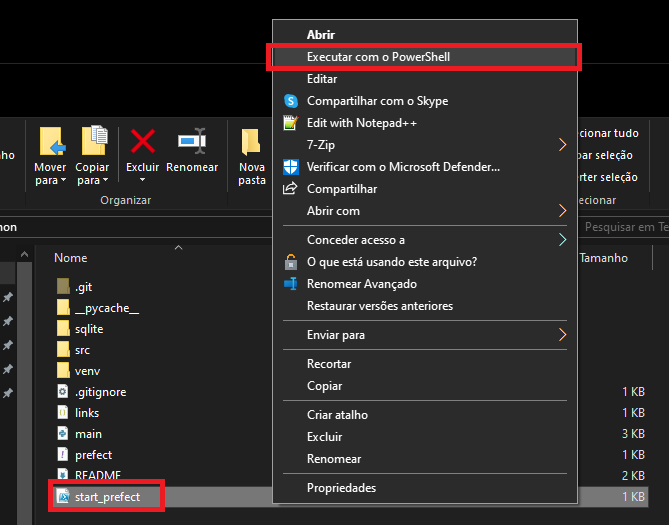

# Teste Desenvolvedor Python

Este projeto foi desenvolvido como uma ferramenta para:

- Acessar links da Web com arquivos CSV, através de automação Web.
- Extrair informações dos arquivos CSV. Esses arquivos CSV são tabelas alimentadas com informações sobre a Balança Comercial do Brasil, e fornecem dados sobre receita, despesa e saldo total de cada mês, desde janeiro de 1995 até janeiro de 2024.
- Salvar os dados extraídos em uma tabela no banco de dados.
- Possibilitar o monitoramento e o gerenciamento das tarefas através do Prefect.

## Executar 

Para executar o software:

- Execute com arquivo start_prefect.ps1 com o Powershell para iniciar o worker e o servidor do Prefect. Esse arquivo também instalará as dependências necessáraias;
- Para executar com o Powershell, basta clicar com o botão direito no arquivo, e clicar em "Executar com o Powershell", conforme mostra a imagem a seguir:

- Garante que o terminal Powershell será executado na mesma pasta do projeto completo;
- Caso ainda seja necessário instalar alguma biblioteca, utilize o comando `pip install xxxx` no terminal, substituindo 'xxxx' pelo nome da biblioteca ou módulo desejado;
- Acesse o link `localhost:4200`;
- Clique em 'Deployments';
- E então, haverá os deploys elaborados e prontos para serem executados pela interface.
- !!! 

## Ferramentas e Tecnologias Utilizadas

Para o desenvolvimento deste projeto, foram utilizadas as seguintes ferramentas e tecnologias:

- Python: principal linguagem utilizada para criar os códigos que coordenam o sistema por completo.
- Pandas: biblioteca da linguagem Python, utilizada para manipular e analisar os dados extraídos.
- Selenium: framework utilizado para realizar os testes das funcionalidades de acesso e extração dos dados das URL's.
- Jupyter Notebook: ambiente para executar o Selenium, permitindo a realização de testes em células independentes.
- SQLite3: sistema de gerenciamento de banco de dados utilizado para fazer consultas, armazenar e manipular os dados extraídos dos arquivos CSV.
- Prefect: utilizado na automação das tarefas implementadas, permitindo o monitoramento, agendamento e execução das tarefas em várias possibilidades.
